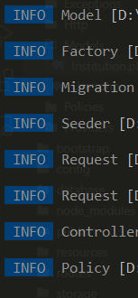
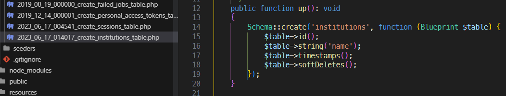

# PROYECTO LARAVEL

## Pasos para crear un proyecto

Laravel es un backend de PHP

(`composer global requiere ...`)

1. Crear proyecto: `laravel new <project_name> --jet` (--jet es porque quiero usar el stack)

    -> inertia  
    -> phpunit (no lo ocupamos)  
    -> no teams  
    -> yes dark mode (opcional)  

2. Ejecutar migraciones `php artisan migrate` -> yes, tiene que ver con la base de datos 

   En el .env del proyecto puedes interactuar con distintos tipos de bases de datos

3. Para correr el proyecto es `npm run dev`

4. Es importante recargar Nginx para que cargue bien el proyecto (click derecho -> www -> <project_name>)

    (pass: 12345678)

## Pasos para ampliar proyectos

1. Crear el modelo con todos sus elementos: 
   
   migración   
   modelo  
   contador  
   request  
   policys  

    Convención de Laravel: Clase en singular y la primera en mayúscula: Flight

2. Alterar la migración. La migración es una clase: id (intenger), nombre (string)

3. Alterar modelo

4. Definir la ruta -- end-point: http://sw_ep2.test:8084/<u>**login**</u>

5. Alterar el controlador

6. Crear las vistas

## Carpetas

Los archivos son clases

(Control + P para buscar)

- **routes** -> web.php: end-points (punto 4)
- **app** -> Models -> User.php: modelos de tu aplicación (punto 1)
- **database** -> migrations: todas las migraciones
- **database** -> seeders:
- **app** -> Http -> Controllers -> Controller.php: Model <-Controller-> Vistas
- **app** -> Http -> Requests: Validar información antes del store
- **resources** -> js -> Pages: vistas

## Ejemplo

- En la carpeta del proyecto, para escalar el proyecto: `php artisan make:model Institution -a`

    

- Se altera la migración (`string` y `softDeletes`)

    

    (Migración: Clase de php que nos permite definir la estructura de una tabla o un modelo)

- Alterar modelo: `protected $fillable = ['name'];`  fillable = [campos de tu tabla]. Es para cargas masivas

- Definir ruta: `Route::resource('institutions', InstitutionController::class)->names('institutions');`

- Para ver las rutas: `php artisan route:list`

- Alterar controlador

- Crear vistas: Se crean 3 archivos en ./Pages -> ./institutions/ Create.vue - Edit.vue - Index.vue

## Vue

- Estructura básica: template, script, style
- Vue3 tiene el método setup que compacta el código

## Controller

Intermediario entre las vistas y el modelo

Vistas: Index.vue
^
|
Inertia
|
v
Controller: InstitutionsController, Index()
Model: Institutions, id, name

## Factory

Inyectar factores de prueba

Para pruebas de estrés

Método que se utiliza para generar registros ficticios o de prueba. 

`php artisan migrate:fresh --seed` para ejecutar las migraciones junto con los seeders

## Seeder

Funcionalidad que se utiliza para agregar datos iniciales

 

---

## To Do

- [ ] ¿Qué es Vue?
- [ ] ¿Cómo se crean proyectos en Vue?
- [ ] ¿Qué son los props en Vue?
- [ ] ¿Qué son los componentes en Vue?
- [ ] Diferencia entre el API de opciones vs API de composición de Vue
- [ ] Estructura típica de un componente de Vue (Sección template, ...)

Selimati, Selirati?